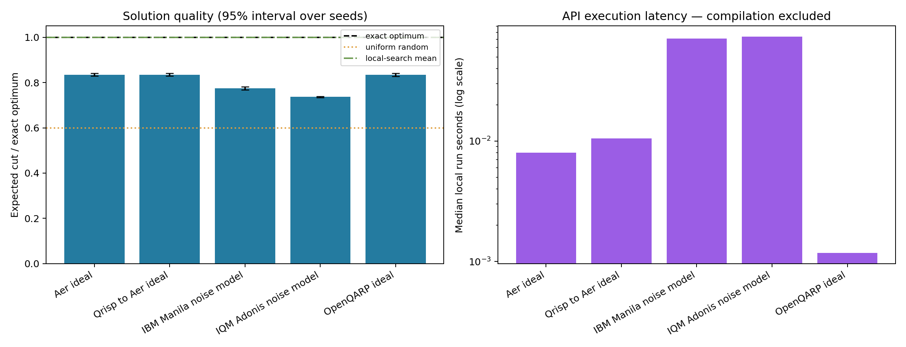

# Research 06 — local validation and sample results

Validated on **2026-09-20**, using a clean project-local Windows / Python 3.12
environment. The notebook was executed with a Jupyter kernel. Its installation
cell was skipped during execution because the same pinned requirements had
already been installed in that environment. **A fresh Google Colab execution
and real-hardware execution have not been performed.**

## Evidence

- Notebook JSON schema validation and Python syntax checks passed.
- All remaining code cells completed without errors, with cloud connections,
  hardware submission, and hardware retrieval disabled.
- `pip check` reported **No broken requirements found**.
- The dependency profile also resolved for Linux x86-64 / Python 3.12, the
  intended Colab platform family. Resolution is not an actual Colab execution.
- Four parameter vectors agreed between NumPy and Qiskit/Qrisp probabilities,
  and between NumPy and OpenQARP expected cut values.
- Asymmetric single-bit tests passed for all five OpenQARP qubits.
- Every compiled local circuit preserved the ideal logical measurement
  distribution after accounting for routing and classical measurement mapping.
- Five tracks × five seeds × 2,048 shots completed: **25 measured simulator runs**.
  Warm-ups and correctness checks were additional, excluded work.
- Offline mock tests passed for IBM/IQM submission, duplicate prevention,
  interrupted-submission guards, recovery using job IDs, logical count ordering,
  and rejection of results from different circuit angles. These tests do not
  establish live account connectivity or QPU compatibility.
- The comparison figure was visually inspected for readable labels and layout.

## Sample findings

The exact weighted MaxCut optimum is **10**. The seeded local-search heuristic
found a cut of 10 in all five starts; uniform random partitions have expected
cut 6. The quantum circuit used p=1 and angles selected from three optimizer
starts. It did not outperform the classical heuristic on this instance.

| Track | Mean expected cut | Mean approximation ratio | Mean optimum-hit probability |
| --- | --- | --- | --- |
| Aer ideal | 8.3492 | 0.8349 | 0.4099 |
| Qrisp → Aer ideal | 8.3492 | 0.8349 | 0.4099 |
| OpenQARP ideal | 8.3372 | 0.8337 | 0.4068 |
| IBM Manila noise model | 7.7448 | 0.7745 | 0.3118 |
| IQM Adonis noise model | 7.3632 | 0.7363 | 0.2821 |

Qrisp and Qiskit share Aer here, so their identical sampled results are not
independent simulator evidence. OpenQARP uses a different RNG implementation;
equal integer seeds do not imply equal random samples. IBM and IQM use different
bundled device models; these scores are not a real-hardware vendor ranking.



## Compatibility and compiler findings

### Section 8 connection refactor

The updated notebook was rerun locally after splitting IBM and IQM into separate
cells. All default local cells completed successfully. Additional offline tests
verified both IBM Secret-name pairs, `instance=...` handling, opt-in account
saving, independent provider state, the IQM Qrisp versus Qiskit adapters, Sirius
exclusion from the direct-coupling benchmark, and the optional Qrisp measurement.
The notebook's IQM installation now includes both `qiskit` and `qrisp` extras;
the real `qrisp.interface.IQMBackend` import and `pip check` passed. Connection
tests used mocked services; they made no live account calls or QPU submissions.
The archived sample below remains the original local simulator run.

### Benchmark environment and routing

The newest IBM Runtime and IQM Qiskit integration have incompatible Qiskit
requirements. The notebook pins a shared compatible profile, including the
SciPy typing dependency, rather than mixing incompatible latest releases.

In this installed stack, `IQMFakeAdonis.run` did not forward `seed_simulator`.
The notebook therefore uses its target and noise model with explicitly seeded
Aer execution. Default IQM MOVE routing also failed the noiseless distribution
check for this Adonis circuit (maximum probability difference about 0.0282).
Using `transpile_to_IQM(..., perform_move_routing=False)` preserved the
distribution to floating-point precision. The IQM hardware path therefore
supports direct-coupling devices and rejects resonator/MOVE architectures.

The notebook measures API wall time, with preparation separate. Warm-ups,
training, imports, and package installation are not included in per-run latency.
OpenQARP rebuilds an engine for each seed, and that work appears in preparation
time. Timing differences are not evidence of quantum advantage or isolated
simulator-kernel performance.

## Reproducibility artifacts

- [Configuration, versions, frozen angles, and ideal distribution](local_sample/manifest.json)
- [All simulator runs and per-run intervals](local_sample/simulator_runs.csv)
- [Summary and 95% intervals over seeds](local_sample/simulator_summary.csv)
- [Raw counts with q0-first labels](local_sample/raw_counts.json)
- [Classical local-search results](local_sample/classical_local_search.csv)
- [Cross-framework correctness checks](local_sample/correctness_checks.csv)
- [Optimizer history](local_sample/optimizer_history.json)
- [Training plot](local_sample/training.png)
- [Dependency check](local_sample/pip_check.txt)

The same folder contains compiled circuit text/QASM, layouts, and the IBM/IQM
noise-model data used for the sample. No credentials or real hardware jobs are
included. Fresh runs produce their own timestamped folder and ZIP under
`benchmark_results/`.

To reproduce locally, create an isolated Python 3.12 environment, install
`requirements-research06.txt` plus `nbformat`, `nbclient`, and `ipykernel`, then run:

```text
python scripts/validate_research_notebook.py
python scripts/test_research_hardware_offline.py
python scripts/test_research_connections_offline.py
```

The validator writes an executed notebook under `Ignore_folder/`. The delivered
Colab notebook stays clean for the next experiment. Its maintainable source is
`scripts/build_benchmark_notebook.py`; running that builder regenerates it.
